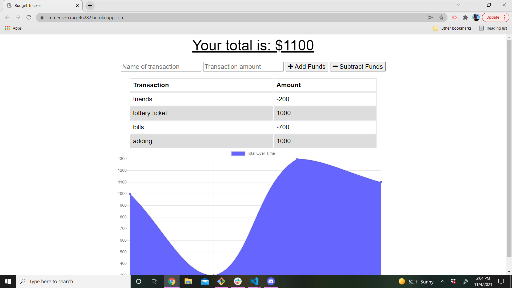

# budget-tracker

## Description 
The purpose of this app is for the user to be able to track their money with a description, amount and show up on a chart. It should be accesible to those online and offline. 

## Live Link 
https://immense-crag-46282.herokuapp.com/ 

## Images of Deployed App 

## Tech Used 
  

(<a href="#top">back to top</a>)
